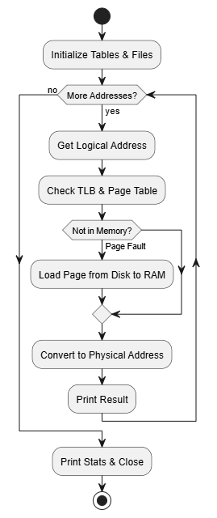

## A3

## Group Members
- Zifan Si
- Stanislav Serbezov

## Individual Contributions
Both members worked together on the code, tests, and debugging.

## File
- `assignment3.c`

## Compile and Run

Compile:
`gcc -Wall -Wextra -std=c11 assignment3.c -o assignment3`

Run:
`./assignment3`

## Input Files
- `addresses.txt`
- `BACKING_STORE.bin`

## Output
Virtual address: 16916 Physical address = 20 Value=0
Virtual address: 62493 Physical address = 285 Value=0
Virtual address: 30198 Physical address = 758 Value=29
...
Virtual address: 57751 Physical address = 9879 Value=101
Virtual address: 23195 Physical address = 15003 Value=-90
Virtual address: 27227 Physical address = 31323 Value=-106
Virtual address: 42816 Physical address = 4416 Value=0
Virtual address: 58219 Physical address = 3179 Value=-38
Virtual address: 37606 Physical address = 10470 Value=36
Virtual address: 18426 Physical address = 30202 Value=17
Virtual address: 21238 Physical address = 20982 Value=20
Virtual address: 11983 Physical address = 3535 Value=-77
Virtual address: 48394 Physical address = 3594 Value=47
Virtual address: 11036 Physical address = 3868 Value=0
Virtual address: 30557 Physical address = 4189 Value=0
Virtual address: 23453 Physical address = 4509 Value=0
Virtual address: 49847 Physical address = 4791 Value=-83
Virtual address: 30032 Physical address = 4944 Value=0
Virtual address: 48065 Physical address = 18113 Value=0
Virtual address: 6957 Physical address = 27693 Value=0
Virtual address: 2301 Physical address = 21245 Value=0
Virtual address: 7736 Physical address = 13112 Value=0
Virtual address: 31260 Physical address = 5148 Value=0
Virtual address: 17071 Physical address = 5551 Value=-85
Virtual address: 8940 Physical address = 5868 Value=0
Virtual address: 9929 Physical address = 6089 Value=0
Virtual address: 45563 Physical address = 6395 Value=126
Virtual address: 12107 Physical address = 6475 Value=-46

Total addresses = 1000
Page_faults = 538
TLB Hits = 54

## workflow

## uml
@startuml
start

:Initialize Tables & Files;

while (More Addresses?) is (yes)
    :Get Logical Address;
    :Check TLB & Page Table;
    
    if (Not in Memory?) then (Page Fault)
        :Load Page from Disk to RAM;
    endif
    
    :Convert to Physical Address;
    :Print Result;
endwhile (no)

:Print Stats & Close;
stop
@enduml